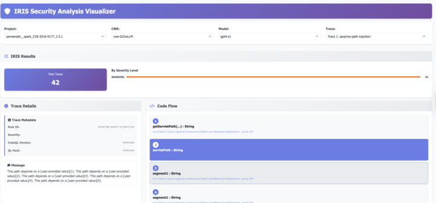

# IRIS Results Visualizer

A web-based visualizer for IRIS static analysis results stored in SARIF format.



## Features

- Interactive visualization of IRIS analysis results
- Code flow visualization with clickable nodes
- Source code display with line highlighting
- Filtering by project, CWE, and trace
- Configurable paths and settings
- User-driven project selection
- Project metadata panel (CVE, CWE, GitHub repo, commits)

## Configuration

The visualizer uses a `config.json` file to configure paths and settings. The configuration file is automatically created with default values if it doesn't exist.

### Configuration Options

```json
{
    "server": {
        "port": 8000,
        "host": "localhost"
    },
    "paths": {
        "outputs_dir": "../output",
        "project_sources_dir": "../data/project-sources",
        "project_info_csv": "../data/project_info.csv"
    },
    "ui": {
        "max_source_code_height": "600px",
        "default_project": "perwendel__spark_CVE-2018-9159_2.7.1"
    }
}
```

### Path Configuration

- **outputs_dir**: Path to the directory containing IRIS analysis outputs (SARIF files)
- **project_sources_dir**: Path to the directory containing project source code
- **project_info_csv**: Path to the CSV file that stores project metadata (CVE, CWE, repo, commits)

### Server Configuration

- **port**: Port number for the HTTP server (default: 8000)
- **host**: Host address for the server (default: localhost)

### UI Configuration

- **max_source_code_height**: Maximum height for the source code display area
- **default_project**: Project that will be pre-selected when the UI first loads

## Usage

1. **Configure paths**: Edit `config.json` to point to your outputs and source directories
2. **Start the server**: Run `python3 server.py`
3. **Open in browser**: Navigate to `http://localhost:8000`
4. **Select a project**: Choose a project from the dropdown to load its analysis results
5. **Filter and explore**: Use the CWE and model filters to explore specific vulnerabilities

## User Flow

1. **Project Selection**: The visualizer starts with an empty state. Users must first select a project from the dropdown.
2. **Data Loading**: Once a project is selected, the visualizer loads all available SARIF files for that project.
3. **Filtering**: Users can then filter by CWE and model to focus on specific vulnerability types.
4. **Trace Exploration**: Click on traces to view detailed information, code flows, and source code.

## Directory Structure

The visualizer expects the following directory structure:

```
output/
├── project1/
│   ├── cwe-352/
│   ├── cwe-352wLLM/
│   │   ├── results.sarif
│   │   ├── api_labels.json
│   │   └── ...
│   └── cwe-352wLLM-final/
|   └── ...
└── project2/
    ├── cwe-022/
    └── cwe-022wLLM/

data/project-sources/
├── project1/
│   ├── src/
│   │   └── main.java
│   └── ...
└── project2/
    └── ...
```

## API Endpoints (server-side)

- `GET /api/projects` - List available projects
- `GET /api/cwes` - List available CWEs
- `GET /api/sarif/{path}` - Get SARIF file content
- `GET /api/source/{project}/{file}` - Get source code file
- `GET /api/project_metadata/{project_slug}` - Get metadata (CVE/CWE/GitHub info) for a project
- `GET /api/models?project={slug}&cwe={id}` - List models that produced results for a given project/CWE
- `GET /api/project_cwes?project={slug}` - List CWEs that have results for a given project
- `GET /api/source_projects` - List source code projects available on disk
- `GET /api/local_file/{project}/{relative_path}?line={n}` - Render a source file in HTML with optional line highlight
- `GET /api/dir?project={slug}&path={subdir}` - Directory listing for the in-browser file explorer
- `GET /api/config` - Get client configuration

## Customization

To use the visualizer with different data sources:

1. Update the `paths` section in `config.json`
2. Ensure your outputs directory follows the expected structure
3. Ensure your project sources directory contains the source code files referenced in the SARIF files

## Troubleshooting

- **404 errors**: Check that the paths in `config.json` are correct and the directories exist
- **Empty project list**: Verify that the outputs directory contains the expected folder structure
- **Source code not loading**: Ensure the project sources directory contains the referenced files
- **No data after project selection**: Check that SARIF files exist for the selected project

## Development

The visualizer consists of:
- `server.py` - Python HTTP server with API endpoints
- `index.html` - Main HTML interface
- `app.js` - Frontend JavaScript logic
- `styles.css` - CSS styling
- `config.json` - Configuration file

## File Structure

```
visualizer/
├── index.html          # Main HTML file
├── styles.css          # CSS styling
├── app.js             # Main JavaScript application
├── server.py          # Python HTTP server
└── README.md          # This file
```

## API Endpoints (server-side)

The server provides the following API endpoints:

- `GET /api/projects` - List all available projects
- `GET /api/cwes` - List all available CWE types
- `GET /api/sarif/{path}` - Get SARIF file content
- `GET /api/source/{project}/{file}` - Get source code file
- `GET /api/project_metadata/{project_slug}` - Get project metadata
- `GET /api/models?project={slug}&cwe={id}` - List models for a project/CWE
- `GET /api/project_cwes?project={slug}` - List CWEs for a project
- `GET /api/source_projects` - List available source code projects
- `GET /api/local_file/{project}/{relative_path}?line={n}` - Render a local file with optional line highlight
- `GET /api/dir?project={slug}&path={subdir}` - Directory listing API

## Configuration

The server is configured to look for:
- **Outputs directory**: `../output` (contains SARIF files)
- **Project sources**: `../data/project-sources` (contains source code)

You can modify these default paths in `server.py`:

```python
OUTPUTS_DIR = "../output"
PROJECT_SOURCES_DIR = "../data/project-sources"
```

## Data Format

The visualizer expects:

1. **SARIF Files**: Located in `output/{project}/{run-id}/cwe-{cwe_id}/results.sarif`
2. **Source Code**: Located in `data/project-sources/{project}/`

### SARIF Structure
The visualizer parses SARIF files and extracts:
- Vulnerability traces (results)
- Code flows (data flow paths)
- File locations and line numbers
- Severity levels and rule information

### Project Structure
```
output/
└── crate__crate_5.5.1_CVE-2023-51982_5.5.1/
    ├── cwe-352/
    │   ├── api_labels_gemini-1.5-flash.json
    │   ├── Spec.yml
    │   └── MySinks.qll
    ├── cwe-352wLLM/
    ├── cwe-352wLLM-final/
    └── cwe-352wLLM-posthoc-filter/
```

## Usage Guide

### 1. Filtering Traces
- **CWE Type**: Filter by specific vulnerability types (e.g., CWE-22, CWE-78)
- **Project**: Filter by specific projects
- **Model**: Filter by AI model used for analysis

### 2. Exploring Traces
- Click on any trace in the left panel
- View the trace description and severity
- Examine the code flow steps
- Click on flow steps to view source code

### 3. Source Code Navigation
- Source code is displayed with syntax highlighting
- Vulnerable lines are highlighted in red
- Click on code flow steps to jump to specific lines
- Line numbers are shown for easy navigation

### 4. Understanding the Results
- **Code Flow**: Shows the path of data from source to sink
- **Source Code**: Displays the actual vulnerable code
- **Severity**: Indicates the security impact level
- **Rule ID**: Shows the specific vulnerability rule

## Troubleshooting

### Common Issues

1. **Server won't start**:
   - Make sure Python 3 is installed
   - Check that the outputs and project-sources directories exist
   - Verify port 8000 is not in use

2. **No traces shown**:
   - Check that SARIF files exist in the outputs directory
   - Verify the file structure matches the expected format
   - Check browser console for error messages

3. **Source code not loading**:
   - Ensure project sources are in the correct directory
   - Check that file paths in SARIF match source file locations
   - Verify file permissions

### Debug Mode

Open browser developer tools (F12) and check the console for:
- API request errors
- Data loading issues
- JavaScript errors

The visualizer exports a global object `window.irisVisualizer` for debugging:
```javascript
// Access loaded data
console.log(window.irisVisualizer.allTraces);
console.log(window.irisVisualizer.currentTrace);
```

## Development

### Adding New Features

1. **New Filter Types**: Add to the HTML and update `populateFilters()` in `app.js`
